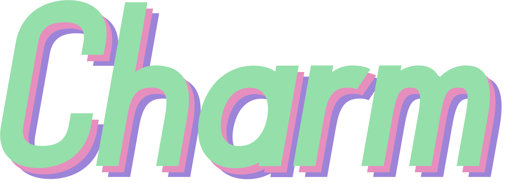

# Charm
A Python-based rhythm engine/game/chart player. Feels like an arcade cabinet, is the hope. Too many features, really!

[Here's a document where I'm hoping to explain all the plans.](https://docs.google.com/document/d/1JfsRuEYCpUTLfjpQqJkV-hqcwWflekKcPTvy2IGboyc/edit?usp=sharing)

## Planned Features
* Play a variety of rhythm game charts from multiple popular custom chart formats
* Completely skinnable, both globally and *per-chart!*
* Toggleable accuracy judgements for every gamemode
* Grading system for every gamemode
* Game accurate scoring for every gamemode
* Customizable hit windows, judgement timings, grade windows, score systems, and more
* An arcade-feel menu system that is a modern twist on a classic style
* Custom Charm-only events and built-in modchart features
* Customizable layouts
* Playlists, a feature that can be expanded to make entire sub-games
* Streamer features

## Planned Supported Chart Formats

* `.chart`, [various guitar games](https://docs.google.com/document/d/1v2v0U-9HQ5qHeccpExDOLJ5CMPZZ3QytPmAG5WF0Kzs/edit) 
* `.mid` (chart), various guitar games, notably Frets on Fire
* `.osu` and `.osz` (mania/taiko), [osu!mania and osu!taiko](https://osu.ppy.sh/wiki/en/osu%21_File_Formats)\*
* `.sm`, [StepMania](https://strategywiki.org/wiki/StepMania/Creating_songs)
* `.bms/.bme/.pms`, [Lunatic Rave 2 (a Beatmania iidx "simulation") and Pop'n Music](https://github.com/BMS-Community/resources#bms-creation)
* `.1`, [Beatmania iidx](https://github.com/SaxxonPike/rhythm-game-formats/blob/master/iidx/1.md), the actual arcade binary chart format (low priority)
* `.json`, [Friday Night Funkin'](https://github.com/ninjamuffin99/Funkin/blob/master/source/ChartParser.hx)

\* The popular Roblox rhythm game *Robeats* also loads `.osz` charts.

